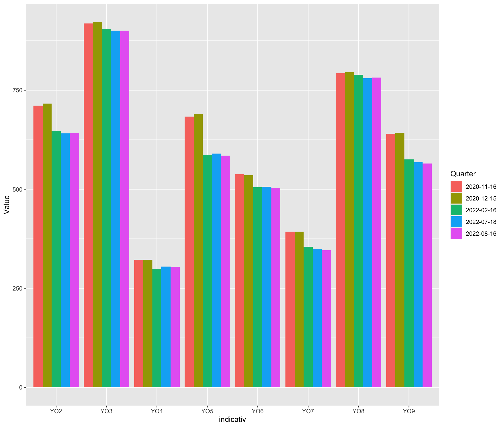
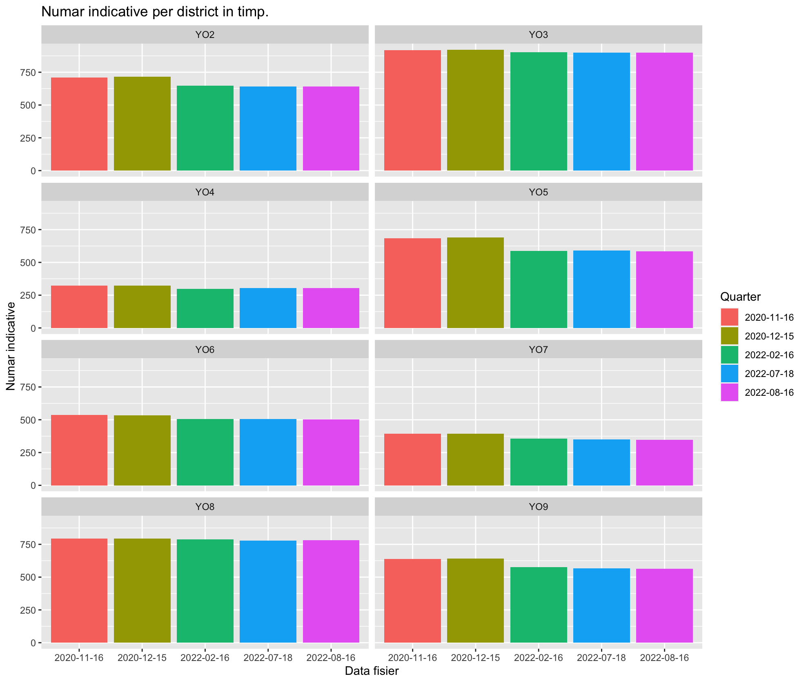
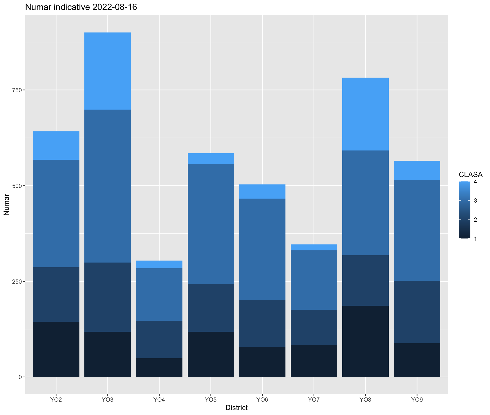

# Ancom Callbook Analysis

## Analiza asupra indicativelor din Callbook

> Aceasta analiza nu doreste sa aduca critici sau sa creeze polemici. Este doar un punct de vedere asupra datelor publicate periodic de Ancom.

Fisierele luate in considerare, sunt urmatoarele:

- [Ancom Callbook_16_11_2020.xlsx](https://www.ancom.ro/uploads/links_files/Callbook_16_11_2020.xlsx)
- [Ancom Callbook_15_12_2020.xlsx](https://www.ancom.ro/uploads/links_files/Callbook_15_12_2020.xlsx)
- [Ancom Callbook_16_02_2022.xlsx](https://www.ancom.ro/uploads/links_files/Callbook_16_02_2022.xlsx)
- [Ancom Callbook_18_07_2022.xlsx](https://www.ancom.ro/uploads/links_files/Callbook_18_07_2022.xlsx)
- [Ancom Callbook_16_08_2022.xlsx](https://www.ancom.ro/uploads/links_files/Callbook_16_08_2022.xlsx)

### Numar de indicative in YO

| indicativ | 2020-11-16 | 2020-12-15 | 2022-02-16 | 2022-07-18 | 2022-08-16 |
| --- | --- | --- | --- | --- | --- |
| YO2 | 711 | 716 | 647 | 641 | 642 |
| YO3 | 918 | 922 | 904 | 900 | 900 |
| YO4 | 322 | 322 | 299 | 305 | 304 |
| YO5 | 683 | 690 | 586 | 590 | 585 |
| YO6 | 538 | 535 | 505 | 506 | 503 |
| YO7 | 393 | 393 | 355 | 349 | 346 |
| YO8 | 793 | 795 | 789 | 780 | 782 |
| YO9 | 640 | 643 | 575 | 568 | 565 |



Din cele 5 fisiere reiese ca cele mai multe indicative sunt in YO3. Deasemenea se vede o usoara tendinta de descrestere a numarului de radioamatori/indicative in toate cele 8 zone.

In imaginea urmatoare putem observa ponderea claselor in totalul indicativelor. S-a luat in considerare situatia din ultimul fisier, cel mai recent.

### Localizare in tara

Dupa ce am eliminat indicativele fara adresa publica, am efectuat geolocation pe adresele ramase. Dintre acestea, doar un numar de 428 au returnat o pozitionare cu latitudine si longitudine, restul avand greseli de ortografiere sau nu au intors coordonate corecte. Aceste puncte au fost plasate pe harta pentru a vedea de sus, unde ne pozitionam noi, radioamatorii. HI.

### Expirari, limita rezervari si erori

Exista o coloana cu data expirarii, si o coloana in care este data limitei rezervarii indicativului, care de obicei este cu 5 ani in plus fata de data expirarii. In cel mai actual fisier sunt _1465_ indicative care expira la final de 2022, un numar de _79_ indicative care isi pierd rezervarea pana la final de 2022, precum si un numar de _209_ care isi pierd rezervarea pana la final de 2023. 

Am remarcat ca sunt si cateva erori in baza de date:

- Y09 in loc de YO9 la un indicativ - a fost corectat in ultimele fisiere din 2022
- 52 indicative din 2 cifre unde clasa este 3 sau 4

